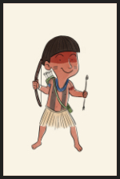
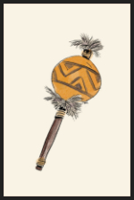
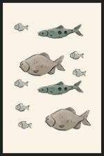
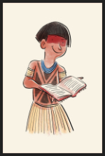
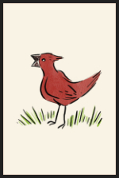
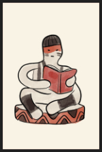
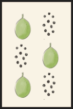

 

 
 

Desenvolvido para o aplicativo do Sesc São Paulo, em 2019, o jogo da memória Kariri Xocó é uma forma lúdica de trazer interatividade para a história contada no livro ["Kariri Xocó: Contos indígenas - Volume 2"](https://www.livrariamaraca.com.br/produto/kariri-xoco-contos-indigenas-v-2-cd-denizia-cruz/), desenvolvido pela escritora, professora e militante Denízia Cruz.

## Cartas 

## Demonstração

<video src="./game.mov"  autoplay controls />

## Tecnologias

Desenvolido em HTML, CSS e Javascript e adaptado para AEM Mobile. 